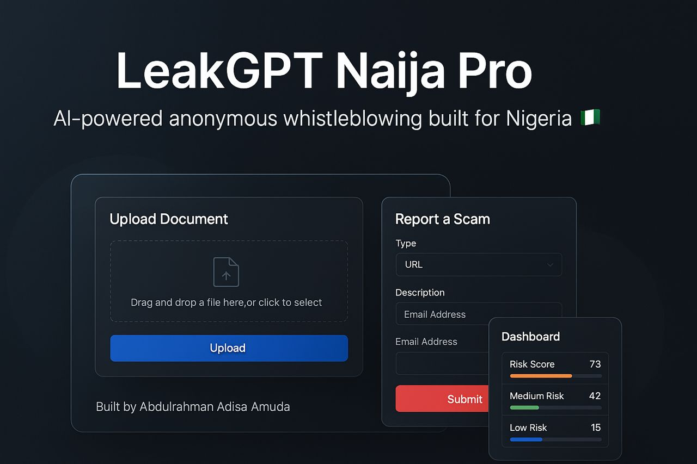

<!-- SEO Metadata -->
<!--
Title: LeakGPT Naija – AI-Powered Corruption Detector 🇳🇬
Description: LeakGPT Naija is an AI-powered corruption analysis tool designed to uncover red flags in documents like contracts, budgets, and audit reports. Built with Flask, Tailwind CSS, and GPT-inspired logic.
Author: Abdulrahman Adisa Amuda
Keywords: LeakGPT, Nigeria, Corruption AI, OpenAI, Budget Analysis, Flask, Tailwind, GPT, anti-corruption, public funds, AI project
-->

<p align="center">
  
</p>


# 🛡️ LeakGPT Naija Pro

> Anonymous whistleblowing & AI-powered fraud detection built for Nigeria.  
> A hybrid Flask-Django web app for secure document analysis, scam reporting, and corruption trend monitoring.  
> 🚀 Built by **Abdulrahman Adisa Amuda** for #3MTT Showcase.

---

## 🌍 Overview

**LeakGPT Naija Pro** is a secure, anonymous platform that enables users to report and detect corruption, scams, and fraud in Nigeria using AI. The system combines a Flask-powered frontend with Django backend intelligence to provide real-time risk scoring and analysis of user-uploaded documents and scam reports.

---

## 🔐 Key Features

### 📄 Document Analysis
- 📂 Upload `.txt` or `.pdf` files (max 16MB)
- 🤖 AI-driven detection of fraud/corruption keywords
- 🧠 Instant scoring (0–100) with summary + flagged terms
- 👤 Anonymous processing (no user tracking)
- 🗑️ Secure file deletion after processing

### 🚨 Scam Reporting
- 📞 Submit suspicious phone numbers, URLs, messages
- 🕵️ Detect Nigerian-specific scam patterns
- ⚠️ Auto-classify risk levels (Low / Medium / High)
- 🔒 Anonymous, encrypted submission

### 📊 Admin Dashboard
- 📥 View all reports & uploads in real-time
- 🗂️ Filter by type, date, keyword, risk score
- 📤 Export reports to CSV
- 📈 Monitor trending flagged terms

### 🔒 Security & Privacy
- 🛑 No user registration or login needed
- 🔐 All data transfer over HTTPS
- 🧾 IP logging is minimal and secure
- 🧹 Files deleted after processing

---

## ⚙️ Tech Stack

| Layer        | Tech Used                        |
|--------------|----------------------------------|
| 🖥️ Frontend     | Flask, Bootstrap 5, Jinja2       |
| 🧠 Backend      | Django, SQLite3, Flask-Login     |
| 🤖 AI Logic     | Python NLP (custom keywords)     |
| 🗃️ Reports & DB | Django Models, SQLAlchemy        |
| 🔑 Auth         | Admin-only (Flask Login)         |
| 🚀 Deployment   | Replit / Heroku (Procfile-ready) |

---

## 🚀 Quick Start

### 📦 Prerequisites
- ✅ Python 3.8+
- ✅ `pip` package manager
- ✅ Git

### 🔧 Installation

```bash
# Clone the repository
git clone https://github.com/your-username/leakgpt-naija-pro.git
cd leakgpt-naija-pro

# Activate virtual environment (optional but recommended)
python -m venv venv
.\venv\Scripts\activate  # On Windows
# source venv/bin/activate  # On macOS/Linux

# Install dependencies
pip install -r requirements.txt
```

### ⚙️ Run the App

```bash
# Run the hybrid app (Flask + Django bridge)
python hybrid_app.py
```

The app should now be live at:  
👉 **http://127.0.0.1:5000**

---

## 📁 Project Structure

```
leakgpt-naija-pro/
├── app.py                  # Flask frontend entry point
├── hybrid_app.py           # Main entry (Flask + Django bridge)
├── manage.py               # Django CLI
├── django_app/             # Django project folder
├── templates/              # Jinja2 HTML templates
├── static/                 # CSS, JS, icons
├── instance/leakgpt.db     # SQLite3 database
├── requirements.txt        # Python dependencies
└── README.md
```

---

## 🤖 AI Analysis Logic

- 🔍 Keyword scanning across financial, legal, and corruption-specific terms  
- 📊 Scoring mechanism based on severity, frequency, and context  
- 🧠 Detection of phishing and fraud pattern keywords in scam reports  

---

## 🧪 Sample Use Cases

- 📰 Journalists verifying leaked documents anonymously  
- 👥 Citizens reporting fraud or corruption in agencies  
- 📉 Analysts monitoring trending risk patterns  

---

## 📢 Attribution & Showcase

🚀 Built by **Abdulrahman Adisa Amuda** for the **#3MTT Showcase**  
Empowering Nigerian innovation through technology 🇳🇬

🧾 The footer of the web app reflects this credit.

---

## 📜 License

This project is released under the **MIT License**.  
Feel free to modify and reuse for civic-tech, anti-corruption, or open government purposes.

---

## 🧠 Footer

> _"Transparency is the enemy of corruption."_ — LeakGPT Naija Pro
